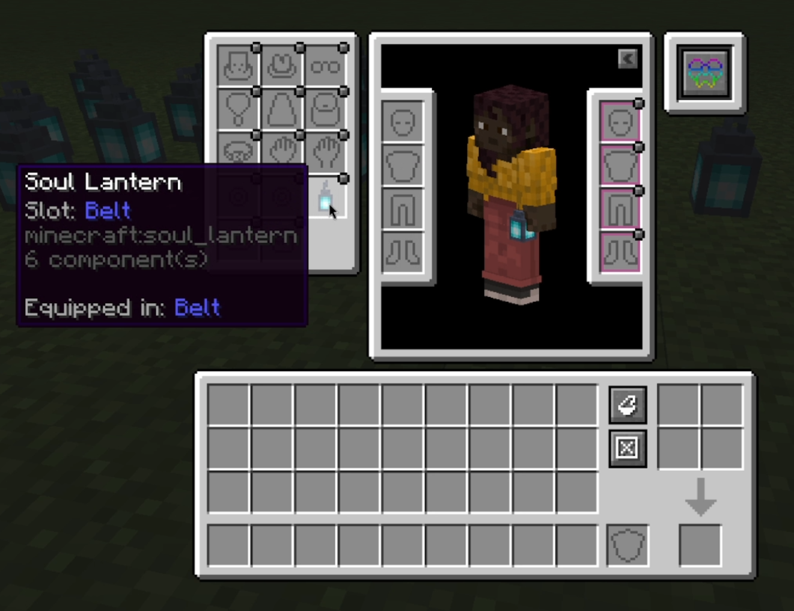

<p align="center">
  
</p>

<p align="center" style="display:flex;justify-content:center;gap:8px;margin:6px 0;">
  <a href="https://modrinth.com/project/beltborne-lanterns-accessories-layer">
    
  </a>&nbsp;
  <a href="https://www.curseforge.com/minecraft/mc-mods/bl-accessories-layer">
    
  </a>&nbsp;
  <a href="https://discord.gg/9JRb3JMAD3">
    
  </a>&nbsp;
  <a href="https://github.com/Shadscure/Beltborne-Lanterns-Accessories-Layer">
    
  </a>
</p>

<p align="center">
  <a href="https://modrinth.com/project/beltborne-lanterns-accessories-layer">
    
  </a>
  <a href="https://modrinth.com/project/beltborne-lanterns-accessories-layer">
    
  </a>
</p>


# Beltborne Lanterns: Accessories Layer

Compatibility bridge between **[Beltborne Lanterns](https://modrinth.com/mod/beltborne-lanterns)** and **[Accessories](https://modrinth.com/mod/accessories)** (WispForest).

Equip your lantern in the Accessories **Belt** slot — it works just like the default belt: sways with physics, casts dynamic light, and keeps your hands free.

## 🧩 What it does

* Registers all Beltborne Lanterns items as valid **Belt** accessories.
* Syncs the belt state — equipping via Accessories or pressing **B** both work seamlessly.
* Fully client & server: renders the lantern on other players and emits light for everyone.

## 📷 Showcase



## ⚙️ Requirements

* **[Beltborne Lanterns](https://modrinth.com/mod/beltborne-lanterns)** — the core mod
* **[Accessories](https://modrinth.com/mod/accessories)** — the accessory API by WispForest

<details>
<summary><strong>🔧 For Modpack Makers</strong></summary>

By default, lanterns can only be placed in the **Belt** slot. You can customize this by editing `config/bl_accessories_layer.json` (auto-generated on first launch):

```json
{
  "allowed_slots": ["belt"]
}
```

To allow additional slots (e.g. `charm`, `necklace`), add them to the list:

```json
{
  "allowed_slots": ["belt", "charm", "necklace"]
}
```

No datapacks or item tags are needed — the mod handles slot validation automatically.

</details>

## 📜 License

This project is licensed under the **Apache License 2.0** — see the [LICENSE](LICENSE) file for details.  
Full license text: [Apache 2.0](https://www.apache.org/licenses/LICENSE-2.0)

<p align="center">
  <sub>Crafted with ❤️ for the Minecraft community</sub>
</p>
